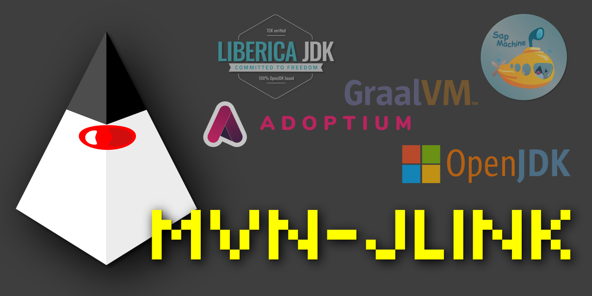

[](http://www.apache.org/licenses/LICENSE-2.0)
[](https://bell-sw.com/pages/downloads/)
[](http://search.maven.org/#artifactdetails|com.igormaznitsa|mvn-jlink-wrapper|1.2.5|jar)
[](https://maven.apache.org/)



[](https://www.arthursacresanimalsanctuary.org/donate)

# Changelog

__1.2.5 (27-sep-2025)__

- added `CORRETTO` provider
  for [AWS Corretto JDK](https://aws.amazon.com/corretto/) [#17](https://github.com/raydac/mvn-jlink/issues/17)
- updated dependencies

__1.2.4 (07-sep-2024)__

- added `ADOPTIUM_API` provider for ADOPTIUM API REST calls [#15](https://github.com/raydac/mvn-jlink/issues/14)
- fixed pattern to extract build version and extensions for ADOPTIUM
  provider [#14](https://github.com/raydac/mvn-jlink/issues/15)
- updated dependencies

[full changelog](CHANGELOG.txt)

# Introduction

Since Java 9, the JDK introduced modules through Project Jigsaw, providing a streamlined approach to building custom JDK
versions containing only the necessary modules. These tailored JDK images can be bundled with Java applications for
optimized deployment. Given my involvement in several Java-based open-source projects, such
as [SciaReto](http://www.igormaznitsa.com/netbeans-mmd-plugin/) and
the [ZXPoly emulator](https://github.com/raydac/zxpoly), I recognized the benefit of offering pre-built JDK images with
these applications. To automate the creation of these images, I developed a Maven plugin, as Maven is my primary tool
for managing OSS projects.

# What does it do?

The functionality of the plugin is straightforward: it allows the execution of tools located in the JDK's bin directory,
such as `jdeps` and `jlink`. In cases where a specific JDK version is required to create an image, the plugin includes
an internal mechanism that automatically downloads the necessary version of OpenJDK from a designated provider, unpacks
it,
and makes it available for building the JDK image.

At present the plug-in supports listed OpenJDK providers:

* __LOCAL__ - locally provided JDK will be used for operations
* __URL__ - load archive through directly provided URL with optional check of file digest (sha1, sha256, sha384, sha512,
  md2, md3)
* __[MICROSOFT](https://www.microsoft.com/openjdk)__ - Prebuilt binary archives of Microsoft OpenJDK
* __[BELLSOFT](https://www.bell-sw.com/java.html)__ - _(Git based)_ Prebuilt binary archives of OpenJDK 'LIBERICA' for
  many platforms including embedded ones, __it has versions includes JavaFX module__.
* __[ADOPTIUM_API](https://api.adoptium.net/q/swagger-ui/)__ - _(REST API based)_ Prebuilt binary archives of OpenJDK
  Eclipse Adoptium for many
  platforms, downloading through REST API.
* __[ADOPTIUM](https://adoptium.net/)__ - _(Git based)_ Prebuilt binary archives of OpenJDK Eclipse Adoptium for many
  platforms.
* __[SAPMACHINE](https://github.com/SAP/SapMachine)__ - _(Git based)_ Prebuilt binary archives of OpenJDK provided by
  SAP.
* __[GRAALVMCE](https://github.com/graalvm/graalvm-ce-builds)__ - _(Git based)_ Prebuilt JDK distributives of GraalVM
  Community Edition.
* __[CORRETTO](https://docs.aws.amazon.com/corretto/)__ - _(REST API based)_ Prebuilt binary archives of Corretto OpenJDK distribution provided by Amazon.

> **Warning**  
> For Git based providers, it is possible to tune page size during search through `perPage` parameter (by default 40).
> Also it is possible to disable check of digests through configuration boolean `check` parameter (which by default
> true).

# Goals and parameters

All JDK provider parameter info you can get through [the mind map](./assets/mindmap.png).

## Goal `cache-jdk`

The goal is to download the JDK from a specified provider, unpack it, and store the JDK folder path in a custom-named
Maven project property. This property can then be utilized by other plugins within the project.

### Examples

The provided code snippet illustrates the caching mechanism for JDK downloads via a direct URL. When executed, the JDK
is automatically downloaded and unpacked into the plugin's cache directory. Subsequently, the path to the cached JDK is
made available to the Maven project through the `jlink.jdk.path` property.

```xml

<plugin>
  <groupId>com.igormaznitsa</groupId>
  <artifactId>mvn-jlink-wrapper</artifactId>
  <version>1.2.5</version>
  <executions>
        <execution>
            <id>cache-jdk18-openjdk-x64</id>
            <goals>
                <goal>cache-jdk</goal>
            </goals>
            <id>do-cache-jdk</id>
            <goals>
                <goal>cache-jdk</goal>
            </goals>
            <configuration>
                <jdkPathProperty>jlink.jdk.path</jdkPathProperty>
                <jdkCachePath>${project.build.directory}${file.separator}jdkCache</jdkCachePath>

                <provider>URL</provider>
                <providerConfig>
                    <id>openjdk-18-linux-x64</id>
                    <url>
                        https://download.java.net/java/GA/jdk18.0.2/f6ad4b4450fd4d298113270ec84f30ee/9/GPL/openjdk-18.0.2_linux-x64_bin.tar.gz
                    </url>
                    <sha256>cf06f41a3952038df0550e8cbc2baf0aa877c3ba00cca0dd26f73134f8baf0e6</sha256>
                </providerConfig>
            </configuration>
        </execution>
    </executions>
</plugin>
```

The code snippet demonstrates the caching of GraalVM Community Edition (CE). The GraalVM distribution will be
automatically
downloaded and unpacked into the plugin's cache. Its path will then be supplied to the Maven project via the
`jlink.jdk.path` property.

```xml

<plugin>
  <groupId>com.igormaznitsa</groupId>
  <artifactId>mvn-jlink-wrapper</artifactId>
  <version>1.2.4</version>
  <executions>
        <execution>
            <id>cache-jdk17-graalvmce</id>
            <goals>
                <goal>cache-jdk</goal>
            </goals>
            <id>do-cache-jdk</id>
            <goals>
                <goal>cache-jdk</goal>
            </goals>
            <configuration>
                <jdkPathProperty>jlink.jdk.path</jdkPathProperty>
                <jdkCachePath>${project.build.directory}${file.separator}jdkCache</jdkCachePath>

                <provider>GRAALVMCE</provider>
                <providerConfig>
                    <type>java17</type>
                    <version>22.2.0</version>
                    <arch>amd64</arch>
                </providerConfig>
            </configuration>
        </execution>
    </executions>
</plugin>
```

The code snippet illustrates the configuration to cache OpenJDK from the ADOPTION provider within the project's build
folder.
The path to this folder is then stored in the `jlink.jdk.path` project property.

```xml

<plugin>
  <groupId>com.igormaznitsa</groupId>
  <artifactId>mvn-jlink-wrapper</artifactId>
  <version>1.2.5</version>
  <executions>
        <execution>
            <id>cache-jdk-8</id>
            <goals>
                <goal>cache-jdk</goal>
            </goals>
            <configuration>
                <jdkPathProperty>jlink.jdk.path</jdkPathProperty>
                <jdkCachePath>${project.build.directory}${file.separator}jdkCache</jdkCachePath>

                <provider>ADOPTIUM</provider>
                <providerConfig>
                    <version>8U</version>
                    <arch>x64</arch>
                    <type>jdk</type>
                    <impl>hotspot</impl>
                    <build>8u332b09</build>
                </providerConfig>
            </configuration>
        </execution>
    </executions>
</plugin>
```

## Goal `jdeps`

The goal automates work with `JDK/bin/jdeps` utility, it allows to get list of modules needed by a JAR and save result
into a file.

### Example

The example calls jdeps tool from provided JDK over project jar file and saves output into `jdeps.out` situated in
project build folder.

```xml

<plugin>
  <groupId>com.igormaznitsa</groupId>
  <artifactId>mvn-jlink-wrapper</artifactId>
  <version>1.2.5</version>
  <executions>
        <execution>
            <id>call-jdeps</id>
            <goals>
                <goal>jdeps</goal>
            </goals>
            <configuration>
                <output>${project.build.directory}${file.separator}jdeps.out</output>
                <options>
                    <option>${project.build.directory}${file.separator}${project.build.finalName}.jar</option>
                </options>
            </configuration>
        </execution>
    </executions>
</plugin>
```

## Goal `jlink`

The goal automates work with `JDK/bin/jlink` utility, it allows to build JDK image based on `jdeps` output.

### Example

The example calls `jlink` from provided JDK and build JDK version based on report provided by `jdeps` tool in
`jdeps.out` file, also `java.compiler` module will be added. The prepared JDK version will be presented in project build
folder, subfolder `preparedJDK`

```xml

<plugin>
  <groupId>com.igormaznitsa</groupId>
  <artifactId>mvn-jlink-wrapper</artifactId>
  <version>1.2.5</version>
  <executions>
        <execution>
            <id>call-jlink</id>
            <goals>
                <goal>jlink</goal>
            </goals>
            <configuration>
                <jdepsReportPath>${project.build.directory}${file.separator}jdeps.out</jdepsReportPath>
                <output>${project.build.directory}${file.separator}preparedJDK</output>
                <modulePaths>
                    <path>${java.home}${file.separator}jmods</path>
                </modulePaths>
                <addModules>
                    <module>java.compiler</module>
                </addModules>
                <options>
                    <option>--compress=2</option>
                    <option>--no-header-files</option>
                    <option>--no-man-pages</option>
                </options>
            </configuration>
        </execution>
    </executions>
</plugin>
```

## Goal `jdk-tool`

It is a universal goal, it allows to make call to any tool situated in `JDK/bin` and save its output into files.

### Example

The example calls jps tool from provided tool JDK with 5 seconds timeout and its output will be written into `jps.out`
file.

```xml

<plugin>
  <groupId>com.igormaznitsa</groupId>
  <artifactId>mvn-jlink-wrapper</artifactId>
  <version>1.2.5</version>
  <executions>
        <execution>
            <id>call-tool</id>
            <phase>package</phase>
            <goals>
                <goal>jdk-tool</goal>
            </goals>
            <configuration>
                <output>${project.build.directory}${file.separator}jps.out</output>
                <tool>jps</tool>
                <timeout>5</timeout>
                <options>
                    <option>-m</option>
                </options>
            </configuration>
        </execution>
    </executions>
</plugin>
```

# Mind Map of all plug-in parameters

Created with [SciaReto](http://sciareto.org)   

